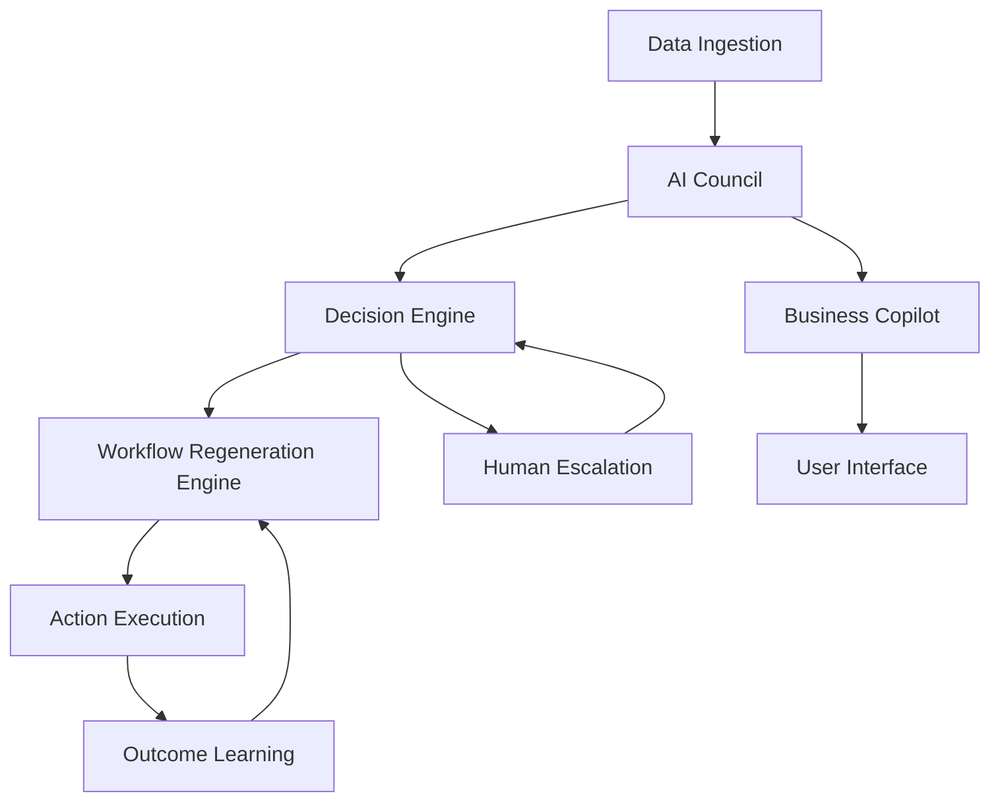

# RetailMind AI Design Document

## Overview

RetailMind AI is a production-ready, multi-agent decision intelligence platform built on AWS that serves retail, commerce, and marketplace ecosystems with a focus on Bharat-scale businesses. The system implements a self-evolving architecture where AI agents collaborate through an AI Council to make autonomous decisions, execute actions through dynamically generated workflows, and continuously learn from outcomes.

The platform follows an Intelligence Loop pattern: **Observe → Analyze → Decide → Act → Learn → Regenerate**, where each cycle improves system performance and adapts to changing business conditions. The core innovation is the Workflow Regeneration Engine that dynamically creates, modifies, and optimizes business workflows without manual intervention.

## Architecture

### High-Level Architecture

The system follows a microservices architecture on AWS with the following layers:

1. **Data Layer**: Multi-tier data storage using S3, DynamoDB, and Redshift
2. **AI & ML Layer**: Amazon Bedrock, SageMaker, and OpenSearch for intelligent processing
3. **Agent Orchestration Layer**: Multi-agent coordination and decision-making
4. **Workflow Engine Layer**: Dynamic workflow generation and execution
5. **API & Interface Layer**: REST APIs and user interfaces
6. **Monitoring & Governance Layer**: Audit trails, explainability, and human oversight

### Agent Architecture

The Multi-Agent AI Council consists of specialized agents:

- **Market Intelligence Agent**: Tracks pricing trends and competitor analysis
- **Demand Forecast Agent**: Handles time-series forecasting and seasonal patterns
- **Pricing Optimization Agent**: Manages margin analysis and price elasticity
- **Inventory Planning Agent**: Optimizes stock levels and supply-demand balance
- **Risk & Compliance Agent**: Processes documents and detects anomalies
- **Business Copilot Agent**: Provides natural language interface for users
- **Workflow Regeneration Agent**: Dynamically generates and optimizes workflows

### Communication Flow



## Components and Interfaces

### Core Components

#### 1. Multi-Agent AI Council
- **Purpose**: Coordinate specialized agents for collaborative decision-making
- **Interface**: Agent Communication Protocol (ACP) using EventBridge
- **Inputs**: Raw data, user queries, system events
- **Outputs**: Coordinated decisions, recommendations, escalations

#### 2. Workflow Regeneration Engine
- **Purpose**: Dynamically generate, modify, and optimize business workflows
- **Interface**: Workflow Definition Language (WDL) and Step Functions
- **Inputs**: Business rules, decision outcomes, performance metrics
- **Outputs**: Executable workflows, workflow modifications, rollback procedures

#### 3. Intelligence Loop Orchestrator
- **Purpose**: Manage the end-to-end observe-analyze-decide-act-learn-regenerate cycle
- **Interface**: Event-driven architecture using EventBridge and Lambda
- **Inputs**: System events, data streams, feedback loops
- **Outputs**: Orchestrated actions, learning updates, system improvements

#### 4. Business Copilot Interface
- **Purpose**: Provide natural language interaction for business users
- **Interface**: REST API and WebSocket for real-time chat
- **Inputs**: Natural language queries, user context
- **Outputs**: Data-backed responses, actionable recommendations

### API Interfaces

#### Agent Communication API
```json
{
  "agentId": "string",
  "messageType": "request|response|broadcast",
  "payload": {
    "data": "object",
    "confidence": "number",
    "reasoning": "string"
  },
  "timestamp": "ISO8601",
  "correlationId": "string"
}
```

#### Workflow Definition API
```json
{
  "workflowId": "string",
  "version": "string",
  "steps": [
    {
      "stepId": "string",
      "type": "lambda|decision|parallel",
      "configuration": "object",
      "conditions": "object"
    }
  ],
  "rollbackProcedure": "object"
}
```

## Data Models

### Core Entities

#### Agent Decision Model
```typescript
interface AgentDecision {
  agentId: string;
  decisionId: string;
  timestamp: Date;
  inputData: any;
  recommendation: {
    action: string;
    confidence: number;
    reasoning: string;
    supportingData: any[];
  };
  escalationRequired: boolean;
}
```

#### Workflow Instance Model
```typescript
interface WorkflowInstance {
  workflowId: string;
  instanceId: string;
  status: 'running' | 'completed' | 'failed' | 'rolled_back';
  steps: WorkflowStep[];
  createdBy: 'system' | 'human';
  generatedBy: string; // Workflow Regeneration Agent ID
  performance: {
    executionTime: number;
    successRate: number;
    businessImpact: number;
  };
}
```

#### Business Intelligence Model
```typescript
interface BusinessIntelligence {
  entityType: 'pricing' | 'demand' | 'inventory' | 'risk';
  entityId: string;
  insights: {
    trend: string;
    prediction: any;
    confidence: number;
    timeframe: string;
  };
  recommendations: ActionRecommendation[];
  dataSource: string[];
}
```

### Data Storage Strategy

- **Amazon S3**: Raw data, historical records, ML model artifacts
- **DynamoDB**: Real-time transactions, agent states, workflow instances
- **Amazon Redshift**: Analytics warehouse, aggregated insights, reporting data
- **Amazon OpenSearch**: Semantic search, document intelligence, knowledge graphs

## Error Handling

### Error Categories and Strategies

#### 1. Agent Communication Errors
- **Timeout Handling**: 30-second timeout with exponential backoff
- **Message Corruption**: Checksum validation and automatic retry
- **Agent Unavailability**: Circuit breaker pattern with fallback agents

#### 2. Workflow Execution Errors
- **Step Failure**: Automatic rollback to last known good state
- **Resource Unavailability**: Queue-based retry with alternative resources
- **Business Rule Violations**: Human escalation with detailed context

#### 3. Data Processing Errors
- **Invalid Data**: Schema validation with error logging and data quarantine
- **Missing Data**: Graceful degradation with confidence level adjustment
- **Data Inconsistency**: Conflict resolution using timestamp and source priority

#### 4. AI Model Errors
- **Low Confidence**: Automatic escalation to human oversight
- **Model Drift**: Continuous monitoring with automatic retraining triggers
- **Prediction Failures**: Fallback to rule-based systems with audit trails

### Escalation Matrix

| Error Type | Confidence Threshold | Escalation Level | Response Time |
|------------|---------------------|------------------|---------------|
| Critical Business Decision | < 80% | Immediate Human | < 5 minutes |
| Financial Risk | < 90% | Senior Analyst | < 15 minutes |
| Compliance Violation | Any | Compliance Officer | < 10 minutes |
| System Failure | N/A | Technical Team | < 2 minutes |

## Testing Strategy

### Dual Testing Approach

The system will implement both unit testing and property-based testing to ensure comprehensive coverage:

- **Unit Tests**: Verify specific examples, edge cases, and integration points between components
- **Property-Based Tests**: Verify universal properties that should hold across all inputs using Hypothesis (Python) for backend services and fast-check (TypeScript) for frontend components

### Unit Testing Strategy

Unit tests will focus on:
- Agent decision logic with specific business scenarios
- Workflow generation algorithms with known input-output pairs
- API endpoint behavior with various request types
- Error handling with specific failure conditions
- Integration between AWS services with mocked responses

### Property-Based Testing Strategy

Property-based tests will be configured to run a minimum of 100 iterations per test and will verify:
- Agent coordination properties across all possible agent combinations
- Workflow regeneration consistency across all business rule changes
- Data integrity properties across all transaction types
- Intelligence loop convergence across all learning scenarios

Each property-based test will be tagged with comments explicitly referencing the correctness property from this design document using the format: **Feature: retailmind-ai, Property {number}: {property_text}**

The testing framework will use:
- **Backend**: Hypothesis for Python-based services
- **Frontend**: fast-check for TypeScript/JavaScript components
- **Integration**: Custom property generators for AWS service interactions
## Cor
rectness Properties

*A property is a characteristic or behavior that should hold true across all valid executions of a system-essentially, a formal statement about what the system should do. Properties serve as the bridge between human-readable specifications and machine-verifiable correctness guarantees.*

### Property Reflection

After analyzing all acceptance criteria, several properties can be consolidated to eliminate redundancy:

- Properties related to data persistence (1.5, 8.1, 9.1) can be combined into a comprehensive data handling property
- Properties related to agent coordination (6.1, 6.2, 8.2, 8.3) can be unified into a single collaboration property  
- Properties related to audit trails (6.5, 10.2, 10.4) can be merged into one comprehensive audit property
- Properties related to escalation (6.4, 10.1) can be combined into a unified escalation property
- Properties related to AWS service usage (9.1, 9.2, 9.3, 9.4, 9.5) can be consolidated into infrastructure compliance

### Core Properties

**Property 1: Market Intelligence Tracking**
*For any* market data input, the Market Intelligence Agent should track pricing trends across all regions and product categories within the specified time constraints
**Validates: Requirements 1.1, 1.2, 1.3, 1.4**

**Property 2: Demand Forecasting Accuracy**
*For any* historical sales data, the Demand Forecast Agent should generate SKU-level forecasts that meet the 85% accuracy requirement for 30-day periods
**Validates: Requirements 2.1, 2.2**

**Property 3: Inventory Optimization Consistency**
*For any* inventory state and demand forecast, the Inventory Planning Agent should detect stock conditions and provide specific reorder recommendations
**Validates: Requirements 2.3, 2.4**

**Property 4: Pricing Optimization Completeness**
*For any* pricing scenario, the Pricing Optimization Agent should generate margin-aware recommendations with competitive analysis and elasticity simulation
**Validates: Requirements 3.1, 3.2, 3.3, 3.4**

**Property 5: Business Copilot Response Quality**
*For any* natural language business query, the Business Copilot should provide data-backed, explainable, action-oriented responses within 10 seconds
**Validates: Requirements 4.1, 4.2, 4.3**

**Property 6: Document Processing Accuracy**
*For any* uploaded document, the Risk Compliance Agent should extract and validate information with 95% accuracy and generate appropriate risk assessments
**Validates: Requirements 5.1, 5.2, 5.4**

**Property 7: Fraud Detection Reliability**
*For any* transaction pattern, the Risk Compliance Agent should detect anomalies and generate alerts with recommended remediation actions
**Validates: Requirements 5.3, 5.5**

**Property 8: Agent Coordination Protocol**
*For any* multi-agent decision scenario, the AI Council should coordinate agents using standardized protocols and implement conflict resolution when needed
**Validates: Requirements 6.1, 6.2, 6.3, 8.2, 8.3**

**Property 9: Workflow Regeneration Adaptability**
*For any* business condition change or workflow outcome, the Workflow Regeneration Agent should dynamically generate or modify workflows without manual intervention
**Validates: Requirements 7.1, 7.2, 7.3**

**Property 10: Intelligence Loop Continuity**
*For any* completed action, the system should capture outcomes, learn from results, and regenerate improved workflows for future use
**Validates: Requirements 7.4, 7.5, 8.4, 8.5**

**Property 11: AWS Infrastructure Compliance**
*For any* system operation, the platform should use appropriate AWS services for data storage, AI processing, orchestration, API access, and monitoring
**Validates: Requirements 9.1, 9.2, 9.3, 9.4, 9.5**

**Property 12: Escalation and Audit Consistency**
*For any* decision or system change, the platform should implement appropriate escalation for high-risk scenarios and maintain comprehensive audit trails
**Validates: Requirements 6.4, 6.5, 10.1, 10.2, 10.4**

**Property 13: Explainability and Error Recovery**
*For any* explanation request or error condition, the system should provide complete reasoning paths and implement graceful error handling with rollback capabilities
**Validates: Requirements 10.3, 10.5**

**Property 14: Continuous Learning and Improvement**
*For any* system interaction or performance measurement, agents should learn from feedback and continuously improve their models and recommendations
**Validates: Requirements 2.5, 3.5, 4.5**

**Property 15: Data Persistence and Ingestion**
*For any* data update or ingestion event, the system should persist information to appropriate storage layers and ensure real-time availability across all sources
**Validates: Requirements 1.5, 8.1**